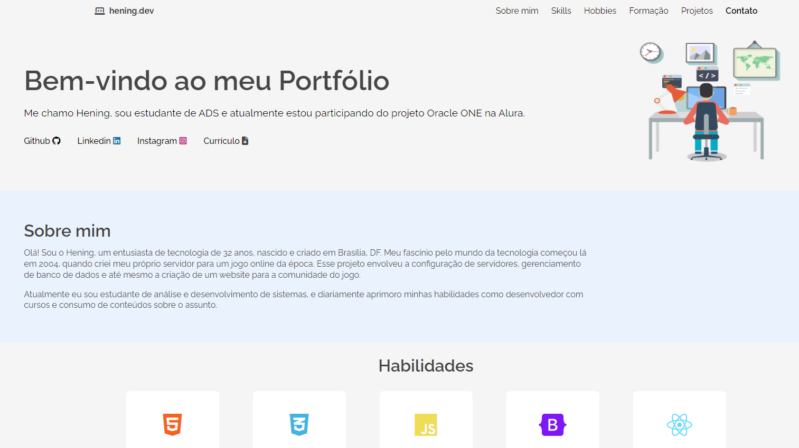

#challengeoneportfolio

### Status do Projeto

# Portfólio
Projeto desenvolvido para o Desafio Front-end / T6-ONE Oracle Next Education em parceria com a Alura. 
O desafio consiste em construir um portfólio para exibir algumas informações pessoais, profissionais, e projetos feitos.

## O que foi utilizado 

  
  
  

## Lógica Utilizada no Código
O projeto utiliza uma abordagem simples para mudança de cor da barra de navegação ao rolar a pagina.
Possui uma interação simples nos icones da Section "Sobre mim" para exibir uma palavra chave para cada icone.
E links como background na imagem de cada projeto.

    
## Demo
[Visualizar no GitHub Pages](https://heningdev.github.io/portfoliochallenge/#){:target="_blank" rel="noopener noreferrer"}

## Screenshot

